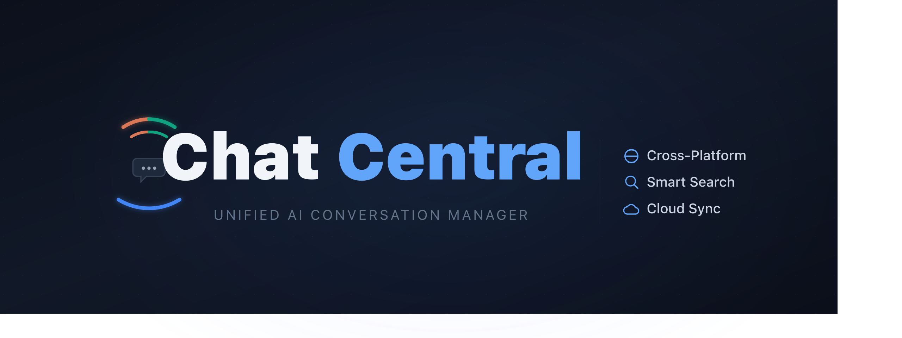

<div align="center"><a name="readme-top"></a>

[](https://www.chatcentral.cc)

One place for all your AI conversations.

Auto-capture, search, tag, and export your Claude, ChatGPT & Gemini conversations — all stored locally in your browser.

**English** · [简体中文](README.zh-CN.md) · [Official Website](https://www.chatcentral.cc) · [Tutorial](https://www.chatcentral.cc/tutorial) · [Privacy](https://www.chatcentral.cc/privacy)

[![][license-shield]][license-link]
[![][website-shield]][website-link]
[![][platforms-shield]][website-link]

</div>

## Feature Roadmap

| Feature                 | Status         | Description                                                     |
| ----------------------- | -------------- | --------------------------------------------------------------- |
| Auto Capture            | ✅ Done        | Intercepts Claude, ChatGPT & Gemini responses automatically     |
| Full-text Search        | ✅ Done        | Instant search across all conversations and messages            |
| Advanced Search         | ✅ Done        | Filter by platform, date range, `tag:`, `is:favorite`, etc.     |
| Spotlight Search        | ✅ Done        | `Cmd/Ctrl+Shift+K` global shortcut for instant lookup           |
| Tags & Favorites        | ✅ Done        | Custom tags, star important conversations, filter by any combo  |
| Import / Export         | ✅ Done        | Markdown, JSON, or ZIP — with checksums and conflict resolution |
| Dashboard               | ✅ Done        | Detail view, batch export, Markdown rendering, theme support    |
| Floating Widget         | ✅ Done        | Quick-access bubble on AI platform pages                        |
| i18n                    | ✅ Done        | English and Simplified Chinese                                  |
| Cloud Sync              | 🚧 In Progress | Google Drive sync with auto background sync                     |
| Batch Delete / Favorite | 📋 Planned     | Extend batch operations beyond export                           |
| Semantic Search         | 📋 Planned     | Search by meaning, not just keywords                            |
| Knowledge Graph         | 📋 Planned     | Link topics and ideas across conversations                      |

## Installation

### Chrome Web Store

[](https://chromewebstore.google.com/detail/chat-central/mkkjdicijdpjgbbbfldonopfjaflllad)

[**Install from Chrome Web Store**](https://chromewebstore.google.com/detail/chat-central/mkkjdicijdpjgbbbfldonopfjaflllad)

### Manual Install

1. Download the latest release from [Releases](https://github.com/flowKKo/chat-central/releases)
2. Unzip the file
3. Open `chrome://extensions/`
4. Enable **Developer mode**
5. Click **Load unpacked** and select the unzipped folder

### Build from Source

```bash
git clone https://github.com/flowKKo/chat-central.git
cd chat-central
pnpm install
pnpm build          # Chrome
pnpm build:firefox  # Firefox
```

## Privacy

- All data stored locally on your device — nothing is sent to any server
- No analytics, no telemetry, no tracking
- No data sent to any third-party server
- Fully open source

## Contributing

Contributions are welcome! Feel free to open an [issue](https://github.com/flowKKo/chat-central/issues) or submit a pull request.

```bash
pnpm install         # Install dependencies
pnpm dev             # Dev server with HMR
pnpm validate        # Type-check + lint + test (run before submitting)
```

See `CLAUDE.md` for architecture details.

## License

[GPL-3.0](LICENSE)

<!-- LINK GROUP -->

[license-shield]: https://img.shields.io/badge/license-GPL--3.0-blue?style=flat-square&labelColor=black
[license-link]: ./LICENSE
[website-shield]: https://img.shields.io/badge/Website-chatcentral.cc-blue?style=flat-square&labelColor=black
[website-link]: https://www.chatcentral.cc
[platforms-shield]: https://img.shields.io/badge/platforms-Claude%20%7C%20ChatGPT%20%7C%20Gemini-purple?style=flat-square&labelColor=black
