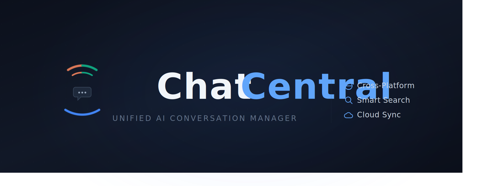
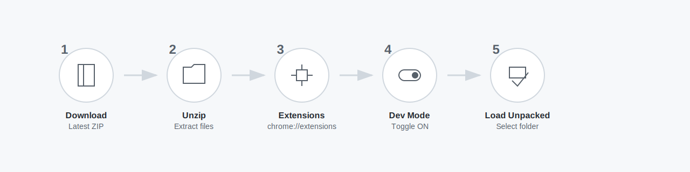

[English](README.md) | [简体中文](README.zh-CN.md)

<p align="center">
  
</p>

<p align="center">
  统一的 AI 对话管理器 — 自动捕获、搜索、标签、导出你在 Claude、ChatGPT 和 Gemini 上的对话。
</p>

## 功能特性

### 捕获与搜索

- **自动捕获** — 聊天时自动保存对话，无需手动操作
- **多平台** — Claude、ChatGPT、Gemini 统一管理
- **全文搜索** — 按标题、内容或消息文本查找对话，支持高亮显示
- **高级搜索** — 支持 `platform:claude`、`tag:work`、`before:2025-01`、`is:favorite` 等语法

### 整理

- **标签** — 添加自定义标签，分类管理对话
- **收藏** — 星标重要对话，快速访问
- **筛选** — 按日期范围、平台或标签筛选

### 导出与同步

- **导出** — 单个或批量导出为 Markdown、JSON 或 ZIP 格式
- **导入** — 从 ZIP 导入，自动处理冲突
- **云同步** — 同步到 Google Drive，支持自动后台同步

### 界面

- **快捷弹窗** — 点击扩展图标即可浏览和搜索对话
- **完整仪表盘** — 全功能管理界面，支持详情查看、Markdown 渲染和批量操作
- **AI 摘要** — 每个对话的可折叠 AI 生成摘要
- **主题** — 亮色、暗色和跟随系统模式，配有平台专属强调色

## 支持平台

| 平台    | 列表同步 | 详情同步 | 流式捕获 |
| ------- | -------- | -------- | -------- |
| Claude  | 是       | 是       | 是       |
| ChatGPT | 是       | 是       | 是       |
| Gemini  | 是       | 是       | —        |

## 安装

### Chrome Web Store

即将上线。

### 手动安装

<p align="center">
  
</p>

1. 从 [Releases](https://github.com/flowKKo/chat-central/releases) 下载最新版本
2. 解压文件
3. 打开 `chrome://extensions/`
4. 启用**开发者模式**
5. 点击**加载已解压的扩展程序**，选择解压后的文件夹

### 从源码构建

```bash
git clone https://github.com/flowKKo/chat-central.git
cd chat-central
pnpm install
pnpm build          # Chrome
pnpm build:firefox  # Firefox
```

## 隐私声明

- 所有数据存储在你的本地设备上 — 除非启用云同步，否则数据不会离开设备
- 云同步使用 Google Drive 的私有文件夹，在你的 Drive 中不可见
- 无分析、无遥测、无追踪
- 不会向任何第三方服务器发送数据
- 完全开源

## 开发

```bash
pnpm install         # 安装依赖
pnpm dev             # 启动开发服务器（HMR）
pnpm validate        # 类型检查 + lint + 测试
pnpm test            # 990+ 测试用例
```

架构详情请参阅 `CLAUDE.md`。

## 许可证

[GPL-3.0](LICENSE)
